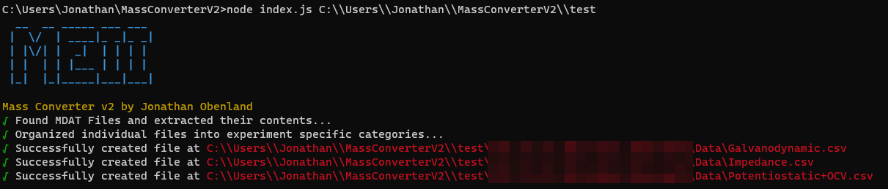

# MassConverterV2

A JavaScript version of the mass converter found on the original datahelper

⚠**THIS SCRIPT DOES NOT CREATE BACKUPS OF FILES BEFORE MANIPULATING THEM DO NOT RUN THIS ON NETWORK ATTACHED STORAGE DEVICES (NAS) AND ONLY RUN LOCALLY IN A TESTING FOLDER**⚠

Written by [Jonathan Obenland](https://github.com/jobenland)
## How to install

Open the location of the repo and run `npm install`. This will automatically install all the dependenices that are necessary to run the program
## Screenshots


## How to run

Once the dependenices are installed, you can run the program by typing `node index.js <path of folder containing MDAT files`. Please note: if you are on a windows device you may need to include double backslashes on the directory path to avoid the character escapes. For example `node index.js C:\\Users\\Jonathan\\MassConverterV2\\test`

## How to alter the script behavior

In order to keep the file structure as organized as possible. Each function has been split in its own file. The flow of the program is as follows:

 - `index.js` first makes a call to the `filehandler.js` function `manipulateFiles`. This step finds all MDAT files and changes them to zip files and extracts their contents into a folder with the same name as the MDAT file. This returns an **array** of folders that were created during this process. Basically, every MDAT file will recieve its own folder the will be appended to the array and passed back to `index.js`
 - `index.js` then iterates over each of the folders and maps their directories using the `sortfilesbyexperiment` function in the `filesorter.js` file. This function will then open each of the files in the folder (.z, .cor, etc.) and locates their *"Exp Title:"* elment and then sorts them into seperate lists since each experiement type will recieve different calculations. Once this process is complete, the `sortfilesbyexperiment` function will return a JSON object containing the sorted files back to `index.js`. A preview of that object looks like:
```JSON
{
  "Folder path": {
    "path": "folder path",
    "impedance": [----.z, -----.z, ------z],
    "galvanodynamic": [----.z, -----.z, ------z],
    "galvanostatic": [----.z, -----.z, ------z],
    "potentionstatic": [----.z, -----.z, ------z]
   }
}
```
- `index.js` then passes this JSON object to the `fileDriver` function of the `analysisdriver.js` file. This file will iterate over every value in the JSON object above and perform the correct calculations for each array. Impedance files will be sent to the `compute` function of the `impedance.js` file and so on so forth. After all calculations are completed for an experiement, the collected data is passed to the `createCSV` function of the `filegenerator.js` file.

*If you intended on altering the behavior of the script, follow the flow of the program to see what values need to be changed where. With this in mind, if you are making changes to the calculations done during the calculation steps for experiemnts, you want to ensure that you are in the `experiment_functions` folder editing the corresponding file for your desired changes*

